# Screenshot Index

このページは、production route監査とlocal-only case reviewのスクリーンショットを確認するための索引です。

元 artifact は `samples/_review/mvp1-route-audit/` にあります。MkDocs から表示するため、同じ画像を `docs/assets/review/mvp1-route-audit/` にコピーしています。

## 配置

| 用途 | パス |
|---|---|
| 元 artifact | `samples/_review/mvp1-route-audit/` |
| MkDocs 表示用コピー | `docs/assets/review/mvp1-route-audit/` |
| 検証記録 | `docs/MVP1_VERIFY_REPORT.md` |

## 画面一覧

| 画面 | Desktop | Mobile |
|---|---|---|
| `/` | <a href="assets/review/mvp1-route-audit/home-desktop.png">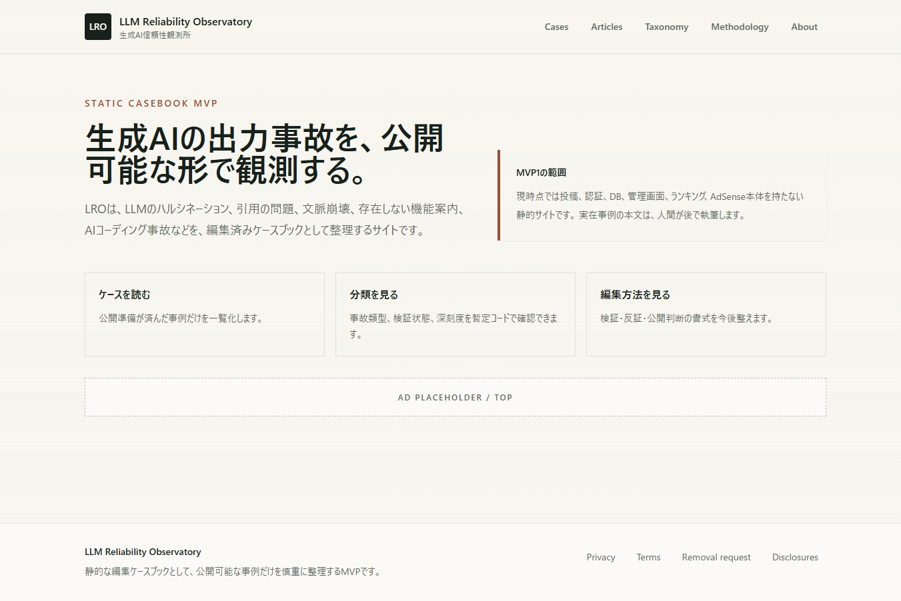</a> | <a href="assets/review/mvp1-route-audit/home-mobile.png">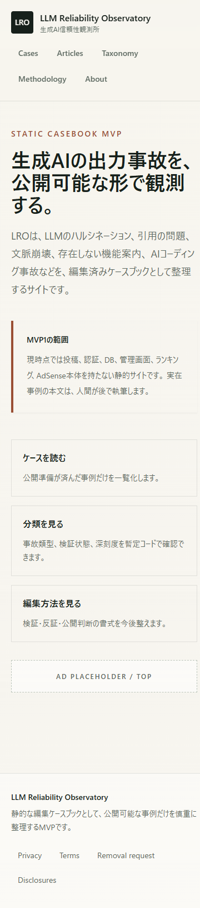</a> |
| `/cases` | <a href="assets/review/mvp1-route-audit/cases-desktop.png">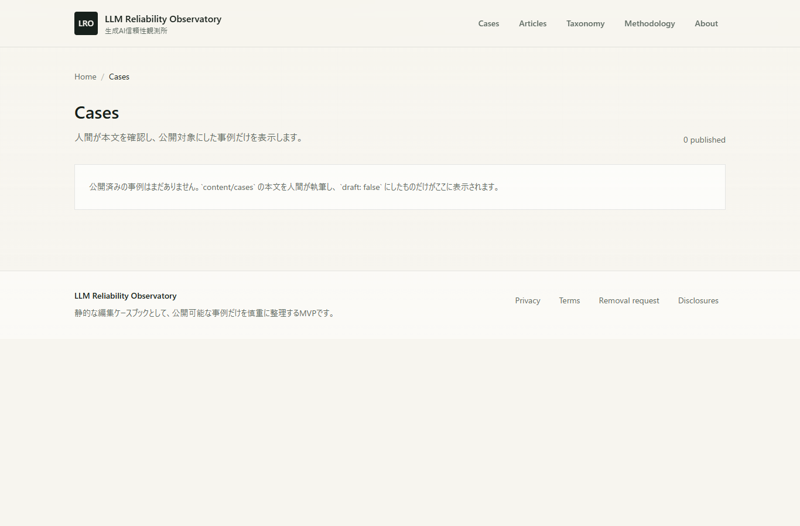</a> | <a href="assets/review/mvp1-route-audit/cases-mobile.png">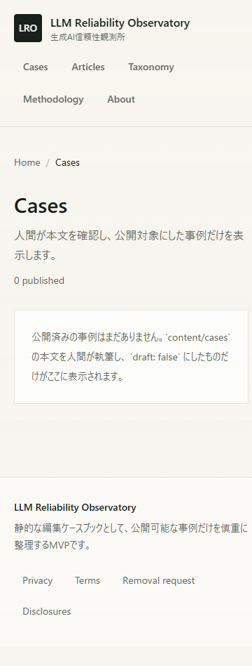</a> |
| `/articles` | <a href="assets/review/mvp1-route-audit/articles-desktop.png">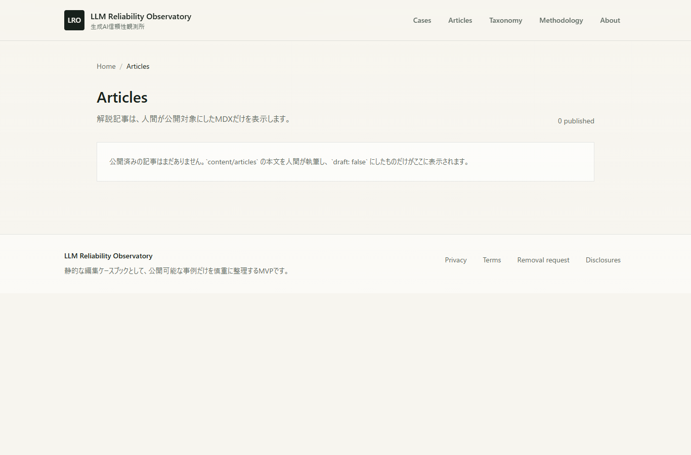</a> | <a href="assets/review/mvp1-route-audit/articles-mobile.png">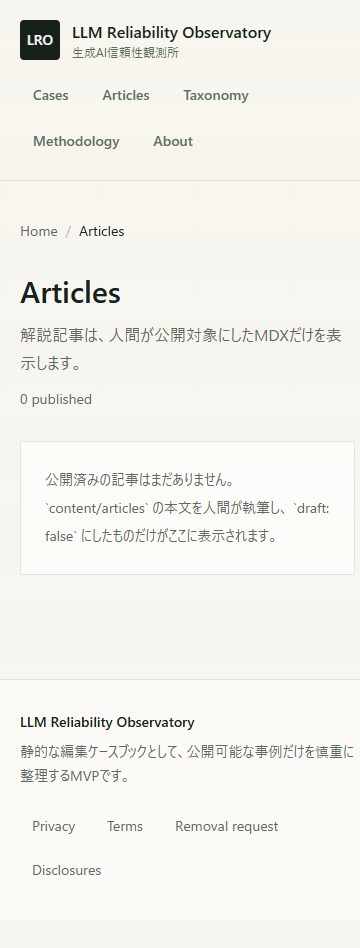</a> |
| `/taxonomy` | <a href="assets/review/mvp1-route-audit/taxonomy-desktop.png">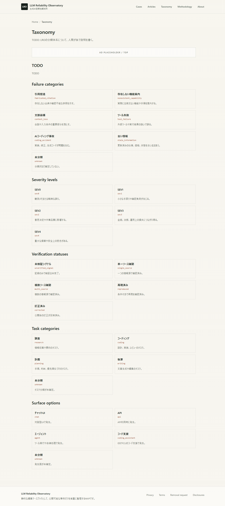</a> | <a href="assets/review/mvp1-route-audit/taxonomy-mobile.png">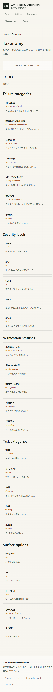</a> |
| `/methodology` | <a href="assets/review/mvp1-route-audit/methodology-desktop.png">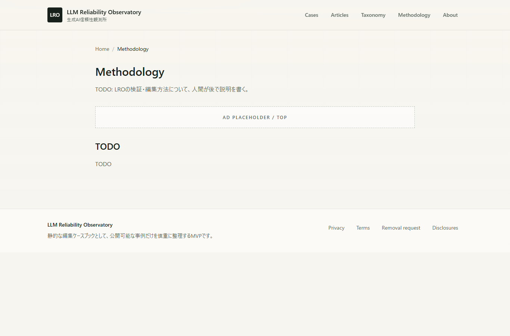</a> | 未保存 |
| `/privacy` | <a href="assets/review/mvp1-route-audit/privacy-desktop.png">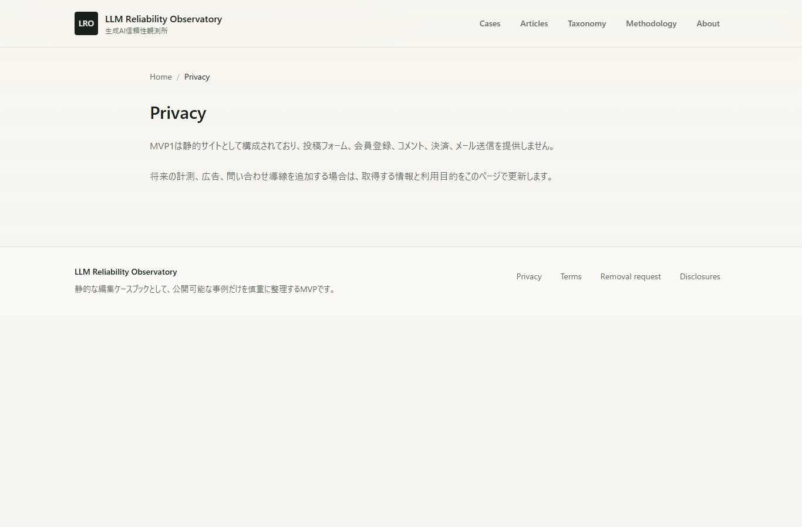</a> | <a href="assets/review/mvp1-route-audit/privacy-mobile.png">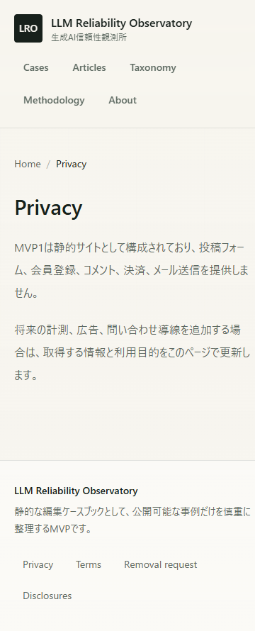</a> |
| `/terms` | <a href="assets/review/mvp1-route-audit/terms-desktop.png">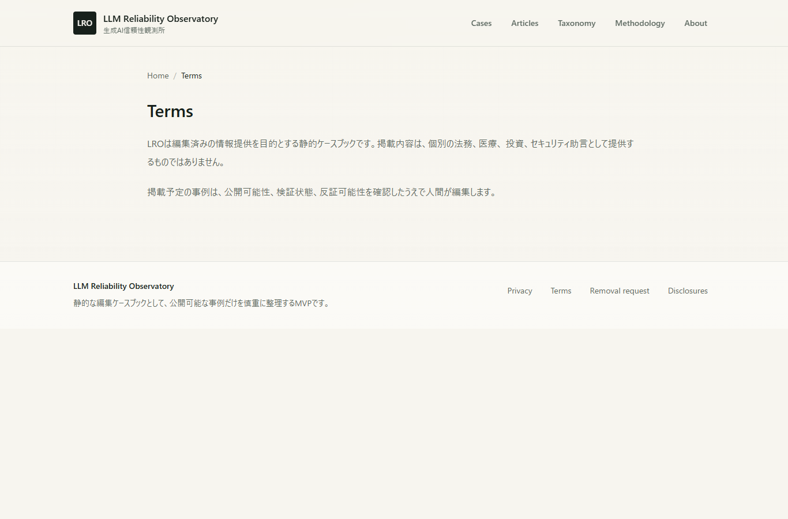</a> | 未保存 |

## 読み方

画像は MVP1 audit 時点の表示確認です。公開 case がまだないため、SeverityBadge、VerificationBadge、CaseCard、RelatedCases の実データ表示は未確認として残っています。

## Publication Engine v2 local review

一次資料付きdraft caseの診断証跡は次にあります。

`samples/_review/publication-engine-v2/002-gpt-4o-sycophancy-rollback/`

| 証跡 | ファイル | 確認内容 |
|---|---|---|
| case card | `case-card.png` | title、severity、verification、case kind、summary |
| detail desktop | `case-detail-desktop.png` | local-only banner、metadata、本文導入 |
| detail mobile | `case-detail-mobile.png` | 390px viewport、横溢れなし |
| source links | `source-links.png` | official source 2件、accessed date、安全な外部リンク |
| machine readback | `readback.json` | schema/publication/route/test結果 |
| human readback | `readback.md` | 判定境界と人間レビュー項目 |

これらは`draft: true` / `review_status: pending`の診断画像であり、公開承認、production route、独立再現の証明ではありません。

4つの`.png`は実体もPNGで、先頭8バイト`89 50 4E 47 0D 0A 1A 0A`を持ちます。`npm run review:verify-images`で拡張子とmagic bytesの一致を検証します。

## Turn 4 mini corpus local review

3件のpending draftを一括比較する診断証跡は次にあります。

`samples/_review/turn4-mini-corpus/`

| 証跡 | ファイル | 確認内容 |
|---|---|---|
| corpus desktop | `corpus-review-desktop.png` | 1280x800、local-only表示、4 filter、3 case card |
| corpus mobile | `corpus-review-mobile.png` | 390x844、filter縦積み、横溢れなし |
| evidence matrix | `corpus-evidence-matrix.md` / `.json` | 採用3件、保留1件、却下1件、証拠境界 |
| machine readback | `corpus-readback.json` | corpus、route、browser、image、human gate |
| human readback | `corpus-readback.md` | case別evidence boundaryと一括編集レビュー項目 |

2つの`.png`はブラウザ取得JPEGを単に改名せず、デコード後にPNGとして再エンコードしたものです。実体の先頭8バイトは`89 50 4E 47 0D 0A 1A 0A`です。3件とも`draft: true` / `review_status: pending`で、画像とreadbackは公開承認を意味しません。
